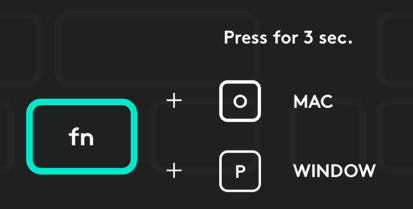

# Dell Monitor Instructions
## Problem Statement
Multiple laptops from different vendors (Dell, Apple), with multiple OS (Windows, MacOS, Linux) and a variety of ports (USB-C, Mini-display, HDMI) will be used with our Dell monitor. This guide explains how to connect each laptop to the monitor, wireless keyboard and mouse, and web cam.

## Dell Monitor Setup
The Dell monitor has the following connected to its various ports:
* USB-C to USB-C cable for connection to laptops with USB-C ports
* HDMI to HDMI cable for connection to laptops without USB-C ports
* Two Bluetooth transponders, one for the wireless keyboard and one for the mouse, connected to USB-A ports
* (Optional) The Logitech webcam connected to a USB-A port. This may be detached and moved to a laptop without USB-C ports.

The USB-C to USB-C cable can carry power to the laptop. It also carries data from any other USB devices connected to the monitor. When a laptop is connected via the USB-C cable, it also connects to the wireless keyboard, mouse and webcam through the same cable. The USB-C cable also carries the video from the laptop to the monitor.

For laptops that do not have a USB-C port, the wireless keyboard, mouse and webcam must be connected in another way. The keyboard and mouse may be connected directly via Bluetooth. The webcam must be connected directly by connecting its USB-A connector cable to the laptop.

## Connection Instructions

### Connecting the Dell Windows Laptop
1. Connect the USB-C to USB-C cable to the laptop
2. Connect the mouse to the laptop
    1. On the bottom of the mouse, move the power switch to the on position. The on position is the position where the exposed surface under the switch is green instead of red.
    2. Press the small button on the bottom of the mouse until the number **1** is lit.
3. Connect the keyboard to the laptop
    1. On the top right surface of the keyboard, move the power switch to the on position. The on position is the position where the exposed surface under the switch is green instead of red.
    2. Above the insert, home and page up keys there are three numbered keys. Press the **1** key.
4. Change the keyboard layout to Windows by holding fn+P (the function key plus the letter P key) for three seconds 
5. (Optional) Connect the webcam to the USB-A port on the side of the monitor.

### Connecting a new Mac Laptop (with USB-C port)
1. Connect the USB-C to USB-C cable to the laptop
2. Connect the mouse to the laptop
    1. On the bottom of the mouse, move the power switch to the on position. The on position is the position where the exposed surface under the switch is green instead of red.
    2. Press the small button on the bottom of the mouse until the number **1** is lit.
3. Connect the keyboard to the laptop
    1. On the top right surface of the keyboard, move the power switch to the on position. The on position is the position where the exposed surface under the switch is green instead of red.
    2. Above the insert, home and page up keys there are three numbered keys. Press the **1** key.
4. Change the keyboard layout to MacOS by holding fn+O (the function key plus the letter O key) for three seconds
5. (Optional) Connect the webcam to the USB-A port on the side of the monitor.

### Connecting an old Mac Laptop (without USB-C ports)
1. Connect the HDMI to HDMI cable to the laptop
2. Connect the mouse to the laptop
    1. On the bottom of the mouse, move the power switch to the on position. The on position is the position where the exposed surface under the switch is green instead of red.
    2. Press the small button on the bottom of the mouse until the number **2** is lit.
3. Connect the keyboard to the laptop
    1. On the top right surface of the keyboard, move the power switch to the on position. The on position is the position where the exposed surface under the switch is green instead of red.
    2. Above the insert, home and page up keys there are three numbered keys. Press the **2** key.
4. Change the keyboard layout to MacOS by holding fn+O (the function key plus the letter O key) for three seconds
5. (Optional) Connect the webcam to a USB-A port on the laptop itself.

## Troubleshooting

### The keyboard won't connect
If the keyboard won't connect, try pressing the numbered button again. When it is correctly connected, you should see a solid white light. If it is blinking, you might need to press it again. 

### The keyboard keys seem off
Did you change the keyboard to the correct layout?
* fn+O for MacOS
* fn+P for Windows and Linux

